# 绘图示例

本文给出文档站支持的**全部绘图样例**：27 种 Mermaid 图形类型与 11 个 PacketDiag 模板，每个都提供「效果 + 源码」对照。源码可直接复制到 <a href="lib/plot-playground.html" target="_blank" rel="noopener">绘图在线预览</a> 中修改后再贴回文档。

## Mermaid 图形（27 种类型）

### 1. flowchart 流程图

语法要点：节点 A[文本]、判断 B{条件}、子图 subgraph

效果：

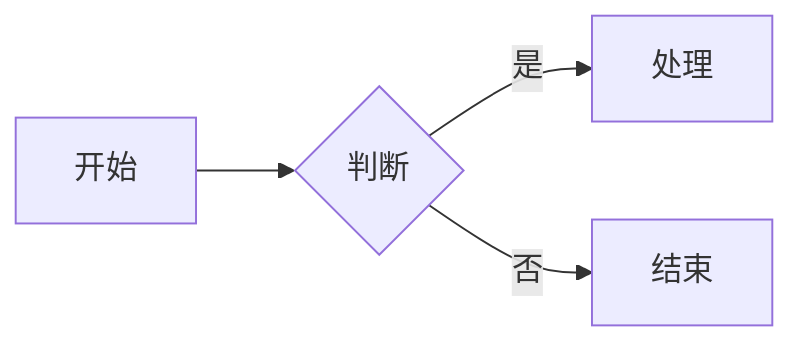

源码：

```text
flowchart LR
  A[开始] --> B{判断}
  B -- 是 --> C[处理]
  B -- 否 --> D[结束]
```

### 2. sequenceDiagram 时序图

语法要点：participant 参与者、->> 请求、-->> 响应

效果：

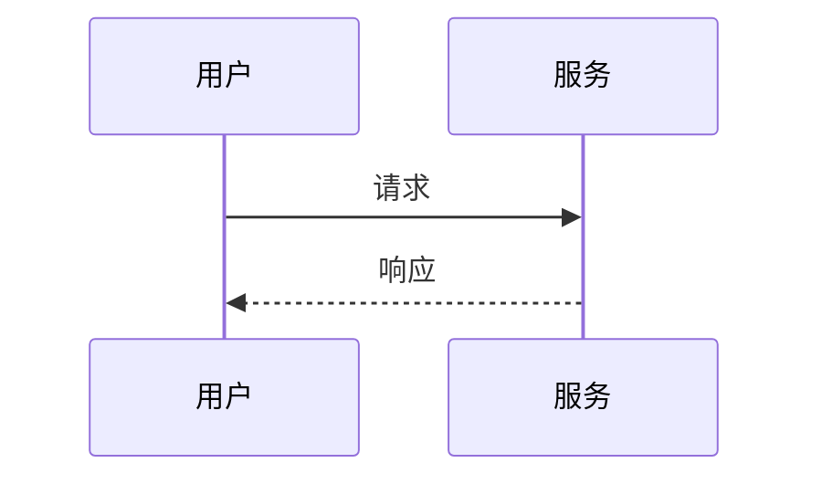

源码：

```text
sequenceDiagram
  participant U as 用户
  participant S as 服务
  U->>S: 请求
  S-->>U: 响应
```

### 3. classDiagram 类图

语法要点：class 类、+属性/+方法、<|-- 继承

效果：

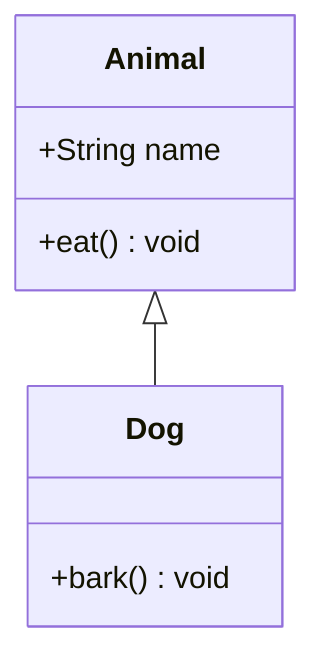

源码：

```text
classDiagram
  class Animal {
    +String name
    +eat() void
  }
  class Dog {
    +bark() void
  }
  Animal <|-- Dog
```

### 4. stateDiagram-v2 状态图

语法要点：[*] 起止状态、A --> B: 事件

效果：

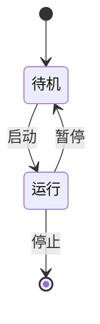

源码：

```text
stateDiagram-v2
  [*] --> 待机
  待机 --> 运行: 启动
  运行 --> 待机: 暂停
  运行 --> [*]: 停止
```

### 5. erDiagram ER 图

语法要点：实体 ||--o{ 关系 : 标签、属性块

效果：

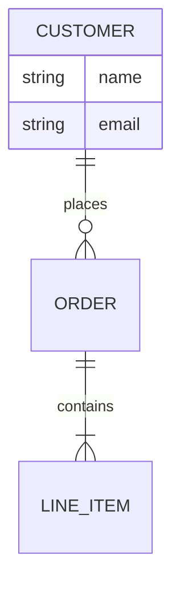

源码：

```text
erDiagram
  CUSTOMER ||--o{ ORDER : places
  ORDER ||--|{ LINE_ITEM : contains
  CUSTOMER {
    string name
    string email
  }
```

### 6. journey 用户旅程

语法要点：section 阶段、任务: 评分: 角色

效果：

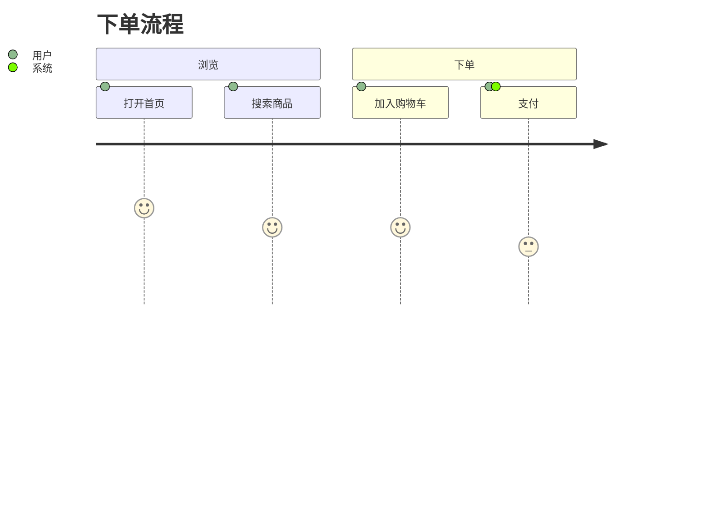

源码：

```text
journey
  title 下单流程
  section 浏览
    打开首页: 5: 用户
    搜索商品: 4: 用户
  section 下单
    加入购物车: 4: 用户
    支付: 3: 用户, 系统
```

### 7. gantt 甘特图

语法要点：dateFormat、section、任务: 状态, id, 开始, 时长

效果：

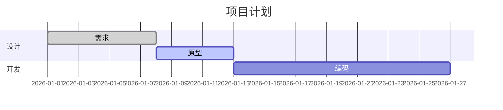

源码：

```text
gantt
  title 项目计划
  dateFormat YYYY-MM-DD
  section 设计
    需求: done, a1, 2026-01-01, 7d
    原型: active, a2, after a1, 5d
  section 开发
    编码: a3, after a2, 14d
```

### 8. pie 饼图

语法要点：pie title、"标签" : 数值

效果：

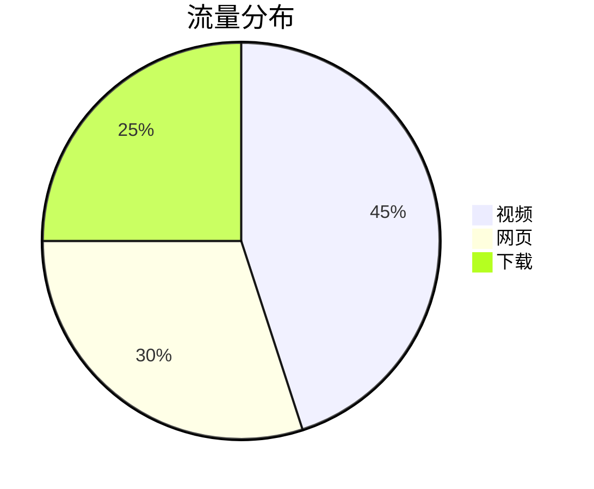

源码：

```text
pie title 流量分布
  "视频" : 45
  "网页" : 30
  "下载" : 25
```

### 9. quadrantChart 四象限

语法要点：x-axis/y-axis、quadrant-1..4、数据点 [x, y]

效果：

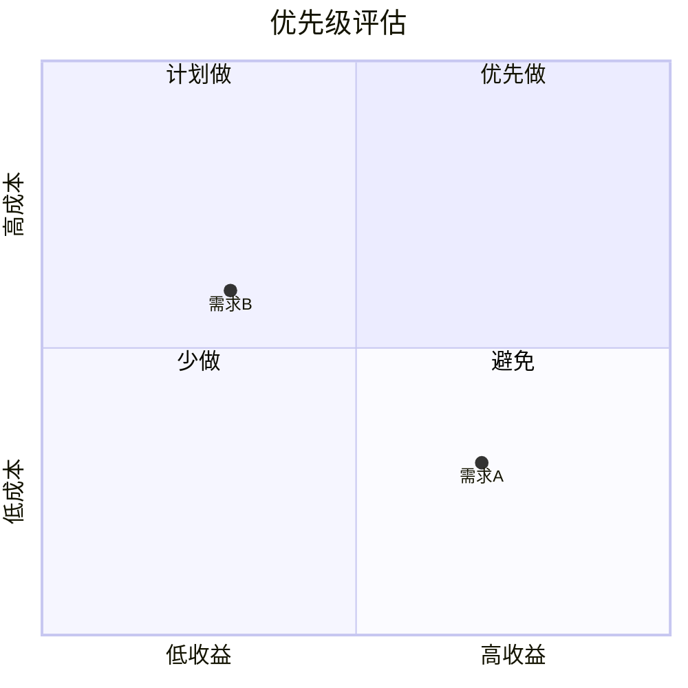

源码：

```text
quadrantChart
  title 优先级评估
  x-axis 低收益 --> 高收益
  y-axis 低成本 --> 高成本
  quadrant-1 优先做
  quadrant-2 计划做
  quadrant-3 少做
  quadrant-4 避免
  需求A: [0.7, 0.3]
  需求B: [0.3, 0.6]
```

### 10. requirementDiagram 需求图

语法要点：requirement { id/text/risk/verifymethod }、element、关系；文本值需加引号

效果：

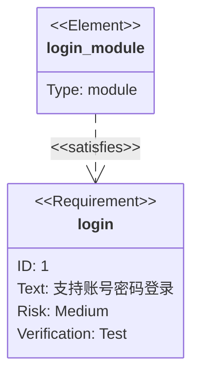

源码：

```text
requirementDiagram
  requirement login {
    id: 1
    text: "支持账号密码登录"
    risk: medium
    verifymethod: test
  }
  element login_module {
    type: module
  }
  login_module - satisfies -> login
```

### 11. gitGraph 提交图

语法要点：commit、branch、checkout、merge

效果：

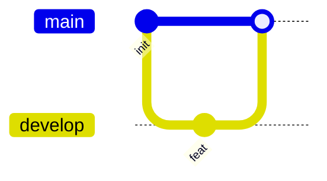

源码：

```text
gitGraph
  commit id: "init"
  branch develop
  commit id: "feat"
  checkout main
  merge develop
```

### 12. mindmap 思维导图

语法要点：root((中心)) 与缩进层级

效果：

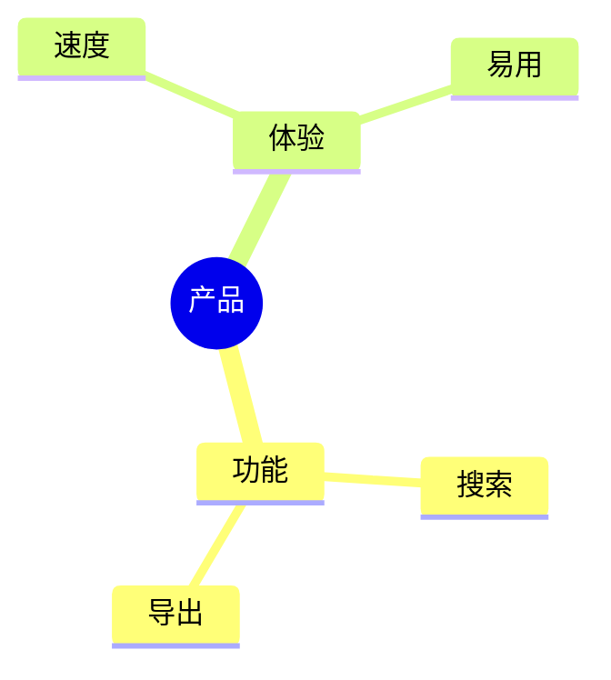

源码：

```text
mindmap
  root((产品))
    功能
      搜索
      导出
    体验
      速度
      易用
```

### 13. timeline 时间线

语法要点：标题、时间 : 事件 : 事件

效果：

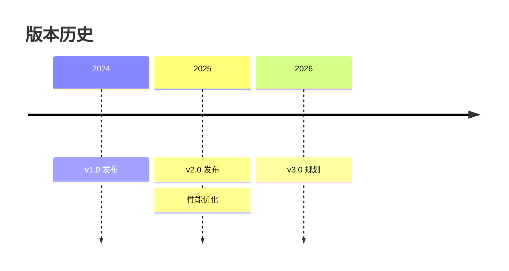

源码：

```text
timeline
  title 版本历史
  2024 : v1.0 发布
  2025 : v2.0 发布 : 性能优化
  2026 : v3.0 规划
```

### 14. sankey 桑基图

语法要点：CSV 三列：来源,目标,数值

效果：

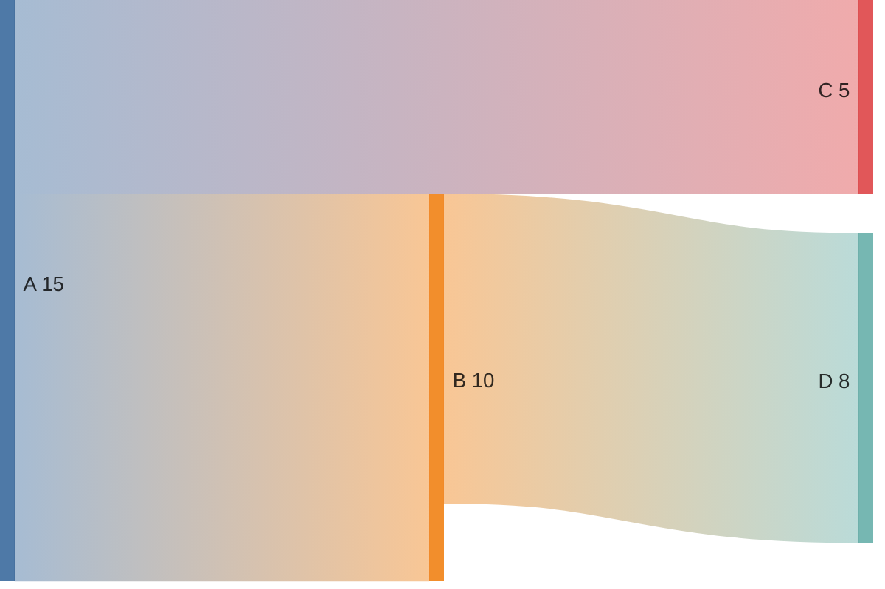

源码：

```text
sankey-beta

A,B,10
A,C,5
B,D,8
```

### 15. xychart XY 图

语法要点：x-axis 分类、y-axis 范围、bar/line 数据

效果：

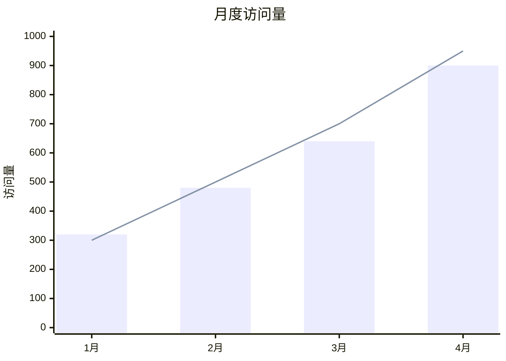

源码：

```text
xychart-beta
  title "月度访问量"
  x-axis ["1月", "2月", "3月", "4月"]
  y-axis "访问量" 0 --> 1000
  bar [320, 480, 640, 900]
  line [300, 500, 700, 950]
```

### 16. block 块图

语法要点：columns 列数、块定义、--> 连线

效果：


源码：

```text
block-beta
  columns 3
  A["输入"] B["处理"] C["输出"]
  A --> B
  B --> C
```

### 17. packet 报文图

语法要点：packet-beta、位范围: "字段"

效果：

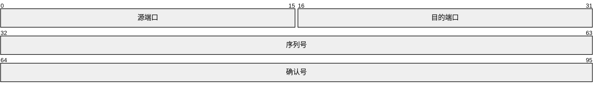

源码：

```text
packet-beta
  0-15: "源端口"
  16-31: "目的端口"
  32-63: "序列号"
  64-95: "确认号"
```

### 18. architecture 架构图

语法要点：group/service(icon)[标题]、:L -- R: 连线

效果：


源码：

```text
architecture-beta
  group api(cloud)[API 层]
  service db(database)[数据库] in api
  service server(server)[服务] in api
  db:L -- R:server
```

### 19. C4 上下文图

语法要点：Person/System/Rel 声明

效果：

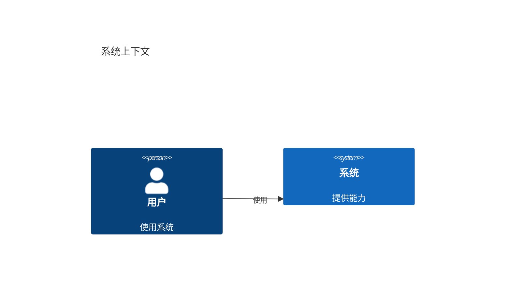

源码：

```text
C4Context
  title 系统上下文
  Person(user, "用户", "使用系统")
  System(sys, "系统", "提供能力")
  Rel(user, sys, "使用")
```

### 20. kanban 看板

语法要点：列[标题] 与缩进任务[描述]

效果：


源码：

```text
kanban
  todo[待办]
    task1[任务一]
    task2[任务二]
  doing[进行中]
    task3[任务三]
  done[已完成]
    task4[任务四]
```

### 21. radar 雷达图

语法要点：axis id["维度"]、curve id["名称"]{数值}、max 上限

效果：

```mermaid
radar-beta
  title 方案对比
  axis perf["性能"], cost["成本"], ease["易用"], eco["生态"]
  curve a["方案A"]{80, 60, 70, 50}
  curve b["方案B"]{60, 80, 50, 70}
  max 100
```

源码：

```text
radar-beta
  title 方案对比
  axis perf["性能"], cost["成本"], ease["易用"], eco["生态"]
  curve a["方案A"]{80, 60, 70, 50}
  curve b["方案B"]{60, 80, 50, 70}
  max 100
```

### 22. treemap 矩形树图

语法要点：层级标题 + "叶子": 数值

效果：

```mermaid
treemap-beta
"根目录"
  "文档": 30
  "源码"
    "前端": 20
    "后端": 25
  "测试": 15
```

源码：

```text
treemap-beta
"根目录"
  "文档": 30
  "源码"
    "前端": 20
    "后端": 25
  "测试": 15
```

### 23. wardley 战略图

语法要点：anchor/component 名称 [可见度, 演进度]、-> 依赖（名称需 ASCII）

效果：

```mermaid
wardley-beta
  title Technology Evolution
  anchor User [0.95, 0.35]
  component System [0.7, 0.5]
  component Database [0.6, 0.75]
  User -> System
  System -> Database
```

源码：

```text
wardley-beta
  title Technology Evolution
  anchor User [0.95, 0.35]
  component System [0.7, 0.5]
  component Database [0.6, 0.75]
  User -> System
  System -> Database
```

### 24. cynefin 决策域

语法要点：complex/complicated/clear/chaotic/confusion 与条目

效果：

```mermaid
cynefin-beta
  title 决策域
  complex
    "探索未知"
  complicated
    "专家分析"
  clear
    "标准流程"
  chaotic
    "紧急响应"
  confusion
    "待归类"
```

源码：

```text
cynefin-beta
  title 决策域
  complex
    "探索未知"
  complicated
    "专家分析"
  clear
    "标准流程"
  chaotic
    "紧急响应"
  confusion
    "待归类"
```

### 25. eventmodeling 事件建模

语法要点：tf 序号 类型 名称（ui/cmd/evt/readmodel 等，名称需 ASCII）

效果：

```mermaid
eventmodeling

tf 01 ui CartUI
tf 02 cmd AddItem
tf 03 evt ItemAdded
tf 04 readmodel CartView
```

源码：

```text
eventmodeling

tf 01 ui CartUI
tf 02 cmd AddItem
tf 03 evt ItemAdded
tf 04 readmodel CartView
```

### 26. treeView 目录树

语法要点：treeView-beta 与缩进层级（带 / 为目录）

效果：

```mermaid
treeView-beta
    my-project/
        src/
            index.js
        package.json
        README.md
```

源码：

```text
treeView-beta
    my-project/
        src/
            index.js
        package.json
        README.md
```

### 27. info 版本信息

语法要点：仅显示 Mermaid 版本

效果：

```mermaid
info
```

源码：

```text
info
```

> 未包含的实验类型（如 `venn`、`ishikawa`、`railroad-*`、`flowchart-elk`）在当前 Mermaid 版本下不稳定或需要额外插件，绘图预览页的下拉框中亦未收录。

## PacketDiag 报文图

围栏语言写 `packetdiag`，使用标准 [packetdiag](http://blockdiag.com/en/nwdiag/packetdiag-examples.html) 语法；字段格式为 `bit[-end]: 标签 [选项]`。

### 1. 默认 64 字节报文（packet）

效果：

```packetdiag

```

源码：

```text

```

### 2. TCP 头部（tcp）

效果：

```packetdiag

```

源码：

```text

```

### 3. IPv4 头部（ipv4）

效果：

```packetdiag

```

源码：

```text

```

### 4. UDP 头部（udp）

效果：

```packetdiag

```

源码：

```text

```

### 5. 以太网帧头（ethernet）

效果：

```packetdiag

```

源码：

```text

```

### 6. 标准示例（standard）

效果：

```packetdiag

```

源码：

```text

```

### 7. 扩展：位序反转 (bit_order = desc)

效果：

```packetdiag
packetdiag {
  colwidth = 32;
  node_height = 44;
  bit_order = "desc";

  28-31: Version;
  24-27: IHL;
  16-23: TOS;
  0-15: Total Length;
  32-47: Identification;
  48-63: Flags + Fragment Offset;
}
```

源码：

```text
packetdiag {
  colwidth = 32;
  node_height = 44;
  bit_order = "desc";

  28-31: Version;
  24-27: IHL;
  16-23: TOS;
  0-15: Total Length;
  32-47: Identification;
  48-63: Flags + Fragment Offset;
}
```

### 8. 扩展：按行编号 (numbering = local)

效果：

```packetdiag
packetdiag {
  colwidth = 32;
  node_height = 44;
  numbering = "local";

  0-15: Word0 High;
  16-31: Word0 Low;
  // @row: Word 1
  0-31: Word1;
  // @row: Word 2
  0-7: Byte 0;
  8-15: Byte 1;
  16-23: Byte 2;
  24-31: Byte 3;
}
```

源码：

```text
packetdiag {
  colwidth = 32;
  node_height = 44;
  numbering = "local";

  0-15: Word0 High;
  16-31: Word0 Low;
  // @row: Word 1
  0-31: Word1;
  // @row: Word 2
  0-7: Byte 0;
  8-15: Byte 1;
  16-23: Byte 2;
  24-31: Byte 3;
}
```

### 9. 扩展：区段 / @row / @left 注释

效果：

```packetdiag
packetdiag {
  colwidth = 32;
  node_height = 44;

  // ---- 请求头 ----
  // @left: 固定 8 字节
  0-31: Magic;
  32-63: Length;
  // @row: 负载
  // @left: 可变长
  64-79: Type;
  80-95: Flags;
}
```

源码：

```text
packetdiag {
  colwidth = 32;
  node_height = 44;

  // ---- 请求头 ----
  // @left: 固定 8 字节
  0-31: Magic;
  32-63: Length;
  // @row: 负载
  // @left: 可变长
  64-79: Type;
  80-95: Flags;
}
```

### 10. 扩展：desctable 描述表

效果：

```packetdiag
packetdiag {
  colwidth = 32;
  node_height = 44;

  0-15: SrcPort [description = "源端口"];
  16-31: DstPort [description = "目的端口"];
  32-63: Seq [description = "序列号"];

  desctable {
    SrcPort = "发送方端口号（16 bits）"
    DstPort = "接收方端口号（16 bits）"
    Seq = "本报文段数据第一个字节的序号"
  }
}
```

源码：

```text
packetdiag {
  colwidth = 32;
  node_height = 44;

  0-15: SrcPort [description = "源端口"];
  16-31: DstPort [description = "目的端口"];
  32-63: Seq [description = "序列号"];

  desctable {
    SrcPort = "发送方端口号（16 bits）"
    DstPort = "接收方端口号（16 bits）"
    Seq = "本报文段数据第一个字节的序号"
  }
}
```

### 11. 扩展：字段属性演示

效果：

```packetdiag
packetdiag {
  colwidth = 32;
  node_height = 52;

  0-3: Ver [color = "#dbeafe"];
  4-7: IHL [textcolor = "red"];
  8-15: TOS [background = "#fce5cd"];
  16-31: Len [rotate = 270];
  32-47: Flags [icon = "flag"];
  48-63: Dash [style = "dashed"];
  64-95: Payload [len = 64];
  96-127: Shape [shape = "ellipse"];
}
```

源码：

```text
packetdiag {
  colwidth = 32;
  node_height = 52;

  0-3: Ver [color = "#dbeafe"];
  4-7: IHL [textcolor = "red"];
  8-15: TOS [background = "#fce5cd"];
  16-31: Len [rotate = 270];
  32-47: Flags [icon = "flag"];
  48-63: Dash [style = "dashed"];
  64-95: Payload [len = 64];
  96-127: Shape [shape = "ellipse"];
}
```

### 常用选项

| 选项 | 说明 | 示例 |
|------|------|------|
| `color` | 填充色 | `[color = "#dbeafe"]` |
| `textcolor` | 文字色 | `[textcolor = "red"]` |
| `rotate` | 标签旋转 90/270 | `[rotate = 270]` |
| `colheight` | 高度倍数 1–12 | `[colheight = 3]` |
| `label` | 显示名 | `[label = "Src Port"]` |
| `description` | 生成字段说明表 | `[description = "RFC 793"]` |
| `style` | 边框样式 | `[style = "dashed"]` |

### 全局配置与增强语法

| 语法 | 说明 |
|------|------|
| `colwidth = 32;` | 每列宽度 |
| `node_height = 48;` | 行高 |
| `default_fontsize = 12;` | 默认字号 |
| `scale_interval = 10;` | 位标尺间隔 |
| `numbering = "global"` / `"local"` | 全局编号 / 按行编号 |
| `bit_order = "desc"` | 位序反转（配合升序范围使用） |
| `// @row: 名称` | 按行分段标题 |
| `// @left: 文本` | 左侧注释 |
| `desctable { 名称 = "说明" }` | 字段说明表 |

> 图形均可点击放大查看；Mermaid 支持下载 SVG / PNG，PacketDiag 支持下载 PNG。绘图预览页提供「复制源码」按钮，可一键把源码复制回文档；阅读区右上角的「下载本页」可把当前文档导出为独立 HTML 文件。
