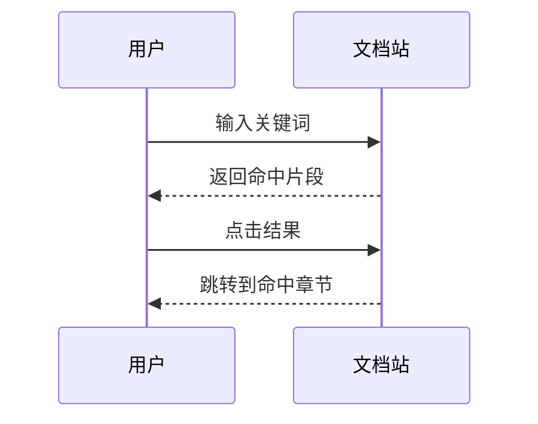

# 绘图示例

本文演示文档站支持的两种绘图语法：**Mermaid** 与 **PacketDiag**。每个示例都给出「效果」与「源码」对照，源码可直接复制到 <a href="lib/plot-playground.html" target="_blank" rel="noopener">绘图在线预览</a> 中修改后再贴回文档。

## Mermaid 图形

围栏语言写 `mermaid`，支持流程图、时序图、状态图、甘特图、类图等，源文与图形对照如下。

### 示例：流程图（flowchart）

效果：


源码：

```text
flowchart LR
  A[编写 Markdown] --> B[运行构建]
  B --> C[离线浏览与搜索]
```

### 示例：时序图（sequenceDiagram）

效果：



源码：

```text
sequenceDiagram
  participant U as 用户
  participant S as 文档站
  U->>S: 输入关键词
  S-->>U: 返回命中片段
  U->>S: 点击结果
  S-->>U: 跳转到命中章节
```

> 更多类型（状态图、类图、甘特图、思维导图、雷达图、时间线等 27 种）可在绘图预览页的下拉框中一键载入模板。

## PacketDiag 报文图

围栏语言写 `packetdiag`，使用标准 [packetdiag](http://blockdiag.com/en/nwdiag/packetdiag-examples.html) 语法；字段格式为 `bit[-end]: 标签 [选项]`。

### 示例：TCP 头部

效果：

```packetdiag
packetdiag {
  colwidth = 32;
  node_height = 48;
  default_fontsize = 12;

  0-15: Src Port;
  16-31: Dst Port;
  32-63: Sequence Number;
  64-95: Acknowledgment Number;
  96-99: Data Offset;
  100-105: Reserved;
  106-111: Flags [color = "#fde68a"];
  112-127: Window;
  128-143: Checksum;
  144-159: Urgent Pointer;
}
```

源码：

```text
packetdiag {
  colwidth = 32;
  node_height = 48;
  default_fontsize = 12;

  0-15: Src Port;
  16-31: Dst Port;
  32-63: Sequence Number;
  64-95: Acknowledgment Number;
  96-99: Data Offset;
  100-105: Reserved;
  106-111: Flags [color = "#fde68a"];
  112-127: Window;
  128-143: Checksum;
  144-159: Urgent Pointer;
}
```

### 示例：IPv4 头部（带 description）

`description` 会生成字段说明表，便于注册手册类文档对照阅读。

效果：

```packetdiag
packetdiag {
  colwidth = 32;
  node_height = 52;
  default_fontsize = 12;

  0-3: Version [description = "IP 版本，通常为 4"];
  4-7: IHL [description = "首部长度（32 位字数）"];
  8-15: TOS [color = "#dbeafe"];
  16-31: Total Length;
  32-47: Identification;
  48-50: Flags;
  51-63: Fragment Offset;
  64-71: TTL;
  72-79: Protocol;
  80-95: Header Checksum [color = "#fef3c7"];
  96-127: Source Address;
  128-159: Destination Address;
}
```

源码：

```text
packetdiag {
  colwidth = 32;
  node_height = 52;
  default_fontsize = 12;

  0-3: Version [description = "IP 版本，通常为 4"];
  4-7: IHL [description = "首部长度（32 位字数）"];
  8-15: TOS [color = "#dbeafe"];
  16-31: Total Length;
  32-47: Identification;
  48-50: Flags;
  51-63: Fragment Offset;
  64-71: TTL;
  72-79: Protocol;
  80-95: Header Checksum [color = "#fef3c7"];
  96-127: Source Address;
  128-159: Destination Address;
}
```

### 常用选项

| 选项 | 说明 | 示例 |
|------|------|------|
| `color` | 填充色 | `[color = "#dbeafe"]` |
| `textcolor` | 文字色 | `[textcolor = "red"]` |
| `rotate` | 标签旋转 90/270 | `[rotate = 270]` |
| `colheight` | 高度倍数 1–12 | `[colheight = 3]` |
| `label` | 显示名 | `[label = "Src Port"]` |
| `description` | 生成字段说明表 | `[description = "RFC 793"]` |
| `style` | 边框样式 | `[style = "dashed"]` |

> 图形均可点击放大查看；Mermaid 支持下载 SVG / PNG，PacketDiag 支持下载 PNG。绘图预览页提供「复制源码」按钮，可一键把源码复制回文档；阅读区右上角的「下载本页」可把当前文档导出为独立 HTML 文件。
