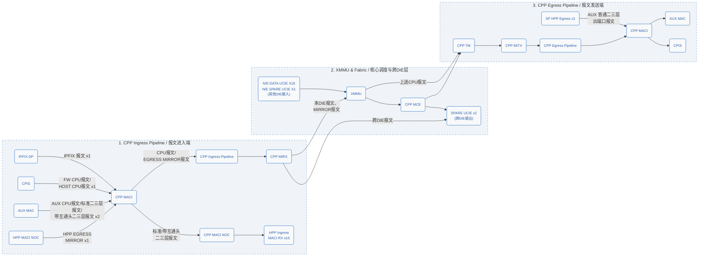

# 仿真环境搭建

## 步骤一

内容

```mermaid
flowchart LR
    %% 定义全局样式
    classDef box fill:#F8F9FA,stroke:#5A8FD3,stroke-width:1.5px,color:#2A5CAA,font-size:13px;
    classDef subGraphStyle fill:#F0F4F8,stroke:#5A8FD3,stroke-width:1px,stroke-dasharray: 5 5;

    %% ----------------阶段一：Ingress 处理----------------
    subgraph INGRESS [1. CPP Ingress Pipeline / 报文进入端]
        direction LR
        HMN("HPP MACI NOC"):::box
        AM_IN("AUX MAC"):::box
        CPIS_IN("CPIS"):::box
        IPDP("IPFIX DP"):::box
        
        CM_IN("CPP MACI"):::box
        CIP("CPP Ingress Pipeline"):::box
        CMIRX("CPP MIRX"):::box
        
        %% Ingress 本地的 HPP 旁路流向
        CMN("CPP MACI NOC"):::box
        HIMR("HPP Ingress<br>MACI RX x16"):::box

        HMN -- "HPP EGRESS<br>MIRROR x1" --> CM_IN
        AM_IN -- "AUX CPU报文/标准二三层报文/<br>带互通头二三层报文 x2" --> CM_IN
        CPIS_IN -- "FW CPU报文/<br>HOST CPU报文 x1" --> CM_IN
        IPDP -- "IPFIX 报文 x1" --> CM_IN

        CM_IN -- "标准/带互通头<br>二三层报文" --> CMN --> HIMR
        CM_IN -- "CPU报文/<br>EGRESS MIRROR报文" --> CIP --> CMIRX
    end

    %% ----------------阶段二：核心调度与跨 DIE----------------
    subgraph FABRIC [2. XMMU & Fabric / 核心调度与跨DIE层]
        direction LR
        XMMU("XMMU"):::box
        CMCE("CPP MCE"):::box
        SUCIE_OUT("SPARE UCIE x2<br>(跨DIE输出)"):::box
        
        UCIE_IN("N/E DATA UCIE X16<br>N/E SPARE UCIE X1<br>(其他DIE输入)"):::box

        %% 来自 Ingress 的输入
        CMIRX -- "跨DIE报文" --> SUCIE_OUT
        CMIRX -- "本DIE报文、<br>MIRROR报文" --> XMMU
        
        %% 来自其他 DIE 的输入
        UCIE_IN --> XMMU
        
        XMMU --> CMCE
        CMCE --> SUCIE_OUT
    end

    %% ----------------阶段三：Egress 处理----------------
    subgraph EGRESS [3. CPP Egress Pipeline / 报文发送端]
        direction LR
        CTM("CPP TM"):::box
        CMITX("CPP MITX"):::box
        CEP("CPP Egress Pipeline"):::box
        CM_OUT("CPP MACI"):::box
        
        SP_HPP("SP HPP Egress x1"):::box
        
        AM_OUT("AUX MAC"):::box
        CPIS_OUT("CPIS"):::box

        %% MCE 与 XMMU 向 TM (Traffic Manager) 注入报文
        CMCE --> CTM
        XMMU -- "上送CPU报文" --> CTM
        
        CTM --> CMITX --> CEP --> CM_OUT
        
        SP_HPP -- "AUX 普通二三层<br>出端口报文" --> CM_OUT
        
        CM_OUT --> AM_OUT
        CM_OUT --> CPIS_OUT
    end
    
    %% 应用子图样式 (兼容部分 Mermaid 渲染器)
    class INGRESS,FABRIC,EGRESS subGraphStyle;
```